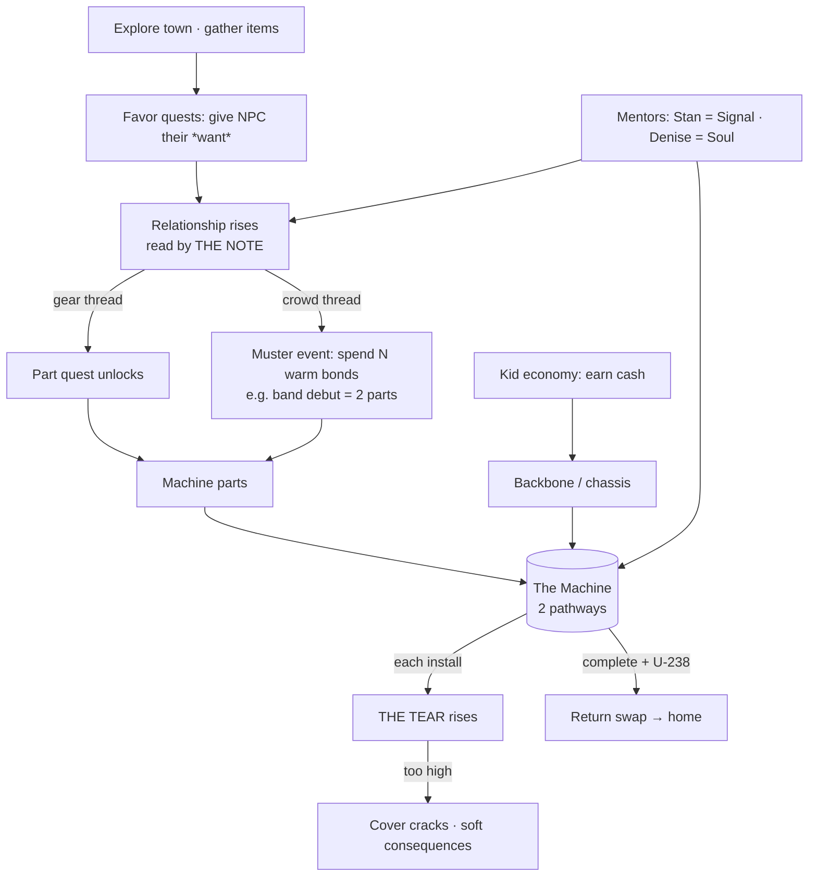

# Survive the 70s — Design Spine (System Map)

> **Status:** CANON-INDEX · **Read me first.** This is the single entry point to the design.
> Every system is summarized here in one screen and **linked out** to its authoritative doc.
> If you're new to a session, read this, then follow the links you need.
>
> **Authority:** This doc does not *override* the system docs — it **indexes** them and defines how
> they connect. When a detail here and a system doc disagree, the **system doc wins** (and this index
> gets corrected). Last mapped: 2026-05-30.
>
> **Reviewing / prioritizing what to build next?** See [`canon-review-packet.md`](canon-review-packet.md)
> — the doc map + every open decision in one prioritized register.

---

## 0. The one-paragraph game

A modern teenager (Mark Cole) wakes in 1976 in the body of **Danny Marek**, a 14-year-old secret
genius whose body-swap machine broke mid-jump, stranding them both. To get home, Mark must **fake
being Danny**, **rebuild the machine from 1976 parts**, and keep his cover intact while the world
quietly senses he doesn't belong. (Full: [`premise.md`](premise.md) — LOCKED v1.)

---

## 1. The four pillars

The whole game stands on four interlocking systems. Everything else is content that feeds them.

| Pillar | What it is | Authoritative doc |
|---|---|---|
| **THE GOAL** | Rebuild the machine — **two pathways**, ~15 parts, each part a quest | machine docs (⚠️ see §6) |
| **THE PRESSURE** | The **Tear** — cover/reality strain that rises as you act out of place | [`components/tear-system.md`](components/tear-system.md) |
| **THE MEANS** | The **kid economy** — money + favors fund parts and the chassis | [`components/money-economy.md`](components/money-economy.md) |
| **THE PEOPLE** | **Relationships** read by **the Note** — unlock quests, parts, and muster events | [`components/relationship-instrument.md`](components/relationship-instrument.md) |

---

## 2. How the systems connect

**The loop in words:** explore → gather → do favors → relationships rise (the Note hears them) →
warm bonds unlock **part quests** or feed **muster events** → parts + cash complete the machine →
each install raises the **Tear** → manage cover → final install + uranium = go home.

---

## 3. THE GOAL — the Machine (two pathways)

Two substrates, two souls, both built in **Danny's basement** (the crafting/storage home base).

- **Path 1 — Signal (electrical).** Perfboard / Erector chassis. Emits the swap signal. **This is the
  pathway that burned** in the first swap. Mentor: **Stan Burns** (Burnsville Electronics).
- **Path 2 — Soul (ritual platform).** A body-sized **board painted by Denise** that the swap-subject
  **lies on**; **5 stone-sockets** in a ring + **amber at the center** (over the heart) + ritual
  items. **Did not burn — just inert.** Mentor: **Denise.** (PROPOSAL:
  [`components/second-pathway-ritual-platform.md`](components/second-pathway-ritual-platform.md).)
- **Fuel:** U-238 uranium, retrieved at Oceanside (Act 3, outside the slot frame).
- **Spent components:** stones + amber **both spent** from the first swap → Mark gets **5 fresh
  stones** (Oceanside hunt; keeps the dull husks as reference) + a **fresh amber-with-inclusion**
  that must be **GIVEN by Iwona** (the love-story key — never bought/recharged).

> ⚠️ **OPEN — machine-doc reconciliation (see §6).** Multiple machine docs model the parts list two
> different ways. They need consolidating into ONE authoritative machine doc before the part backlog
> is final.

---

## 4. THE PRESSURE — the Tear

Cover/reality strain. Rises with every machine install and every "out of place" act; shown as a
**spreading ink stain in the Book** (never a number). Recurring stabilization costs **time**, not
burned items (the anti-hoarding rule). Mentor secret-keeper: **Denise** knows Mark isn't Danny.

> ⚠️ **OPEN — Tear gameplay loop.** The *law* is locked ([`tear-system.md`](components/tear-system.md));
> what's still fuzzy is the moment-to-moment **gameplay**: exactly what raises/lowers it, what the
> soft consequences are, and how it paces across acts. Flagged as a top open loop (§9).

---

## 5. THE MEANS — the kid economy

Money funds the **backbone/chassis** ([`components/backbone.md`](components/backbone.md)) and small
needs; favors fund relationships. Era-true kid income (yardwork, paper drives, returns, trades).
Full model: [`components/money-economy.md`](components/money-economy.md).

---

## 6. THE PEOPLE — relationships + the Note

- **The Note** (Denise's brass **tuning fork**) reads a bond on four audible axes — no numeric stat.
  **It only rings for people who matter to the mission**, which **caps the tracked roster and the
  Book's clutter for free.** *"It won't sing for everyone, child. Only the ones tangled up in what
  you're doing."* Full: [`components/relationship-instrument.md`](components/relationship-instrument.md).
- **Three quest archetypes** (this is the player-legibility key):
  1. **Favor** — give an NPC their *want* (beer cans, a candy, a comic) → warmth up. *No part.* The
     easy explore-and-gather loop.
  2. **Part** — a real challenge → yields a **machine part**. Often **gated behind** a relationship.
  3. **Muster** — spend **N warm bonds at once** → yields part(s). Template = the **band debut**
     (~10 warm kids → 2 parts, [`quests/Q-003-caruso-band-light-show.md`](quests/Q-003-caruso-band-light-show.md)).
- **NPC tiers:** **Mentors** (Stan, Denise — story, not grind) · **Tracked roster** (capped ~10–12,
  the ones the Note hears) · **Ambient** (untracked flavor; "**stores ARE the NPCs**" —
  [`worldbuilding-rules.md`](worldbuilding-rules.md) Rule 1).

---

## 7. Quest architecture & act-gating

- Each tracked NPC's Book page shows **Wants** (their collectible) and **Leads** (a one-line thread),
  with a small doodle marking the lead type: **gear** = Part thread · **crowd** = Muster/social ·
  **envelope** = mentor/story.
- **Act-gating = unlock conditions** (Disco-Elysium style): every quest carries
  `unlock: { act/day ≥ X, rel(person) ≥ Y, prereq-quest }`. This is the lever to distribute content
  across acts without hard walls.
- Quest specs live in [`quests/`](quests/) (template + Q-001..Q-003 + `_quest-item-tracker.md`).
  Scratch ideas in [`scratch/quest-ideas-inbox.md`](scratch/quest-ideas-inbox.md) and [`scratch/quest-seeds.md`](scratch/quest-seeds.md).

---

## 8. The diegetic-UI law

No numeric stat bars. The **Book** is the only persistent UI. The **Tear** = ink stain; the **Note**
= a heard tone / waveform line per name; relationships, quests, and money all surface as **Mark's
terse handwriting**, never as menus of numbers. Conversations are *heard*, not logged — the Book
keeps only the **one-line distilled takeaway.** (Law: [`tear-system.md`](components/tear-system.md) §6/§8.)

---

## 9. Open loops (what's NOT yet locked)

1. **Machine-doc reconciliation** — collapse the 4 machine docs into ONE authoritative spec (§6).
2. **Tear gameplay loop** — the moment-to-moment rules, consequences, and pacing (§4).
3. **NPC roster** — name + cap the tracked people, assign each a Want and a thread type (Part/Muster).
   *(Started: [`characters/roster.md`](characters/roster.md) + the 3-tier system in
   [`characters/README.md`](characters/README.md). Next: fill Prime sheets, mine `intake/people.yaml`.)*
4. **Notebook UX spec** — lock the People-page + Threads-list layout (§7) into the relationship doc.
   *(Dialog-state model now specified in [`characters/README.md`](characters/README.md) §3–4.)*
5. **Part backlog** — ~9 Signal/Vapor part-source quests still need writing (slots = the backlog).
6. **Lock the proposals** — ritual-platform now folded into `machine-architecture.md` (✅ 2026-05-30);
   still pending: the **basement opening rework** ([`story/00-opening.md`](story/00-opening.md)) and the
   **relationship-instrument** ("the Note") lock.
7. **Opening rework** — relocate the wake-up to the basement while preserving locked gold
   ([`story/00-opening.md`](story/00-opening.md)).

---

## 10. Document map (the curated canon set)

**Design against these. Everything else is scratch, reference, or archive (see the buckets below).**

| System | Authoritative doc | Status |
|---|---|---|
| Entry point | `design-spine.md` (this file) | CANON-INDEX |
| Premise / story foundation | `premise.md` | 🔒 LOCKED |
| Story acts | `story/00-opening.md` … `04-ending.md` (canonical beat structure) + `story-arc.draft.md` (script layer — cut-scene dialogue, being folded in) | 🔒 structure / 📝 scripts |
| Gameplay loop | `gameplay-loop.md` | CANON (v0.1) |
| Machine | `components/machine-architecture.md` (canon spine) + `components/backbone.md` (Path-1 chassis) + `components/second-pathway-ritual-platform.md` (Path-2 design) | ✅ RECONCILED 2026-05-30 |
| Machine components (detail) | `components/index.md` ⚠️ (old 10-letter scheme — still referenced by component-J/L, money, tear; reconcile to machine-architecture before archiving), `components/component-*.md` | ⚠️ REVIEW |
| Second pathway | `components/second-pathway-ritual-platform.md` | 📝 PROPOSAL |
| The Tear | `components/tear-system.md` | 🔒 CANON (law) |
| Money / economy | `components/money-economy.md` | CANON |
| Relationships / the Note | `components/relationship-instrument.md` | 📝 PROPOSAL |
| World rules | `worldbuilding-rules.md` | CANON (living) |
| World / locations | `world.md`, `world-map.md` | CANON |
| Quests | `quests/` (specs + tracker + template) | CANON specs |
| Characters | `characters/` (README system + roster + sheets) | CANON system, sheets TBD |
| Decisions ledger | `decisions-log.md` | CANON ledger |
| Production | `production/asset-plan.md`, `learning-plan.md`, `ai-assets-evaluation.md`, `build/renpy-first-night.md` | CANON |

**Buckets (not design-against, but keep):**
- **SCRATCH (idea banks):** `scratch/` — `quest-ideas-inbox.md`, `quest-seeds.md`, `locations-inbox.md`, `intake-raw.md`
- **REFERENCE (source material):** `era-research/`, `intake/`, `research/`, `house-decor-catalog.md`
- **ARCHIVE (stale/superseded/logs):** `archive/` — `bible.md` (self-declared STALE), `sessions/` (transcripts), old `.rpy` concepts

---

## 10a. ⚠️ NEEDS YOUR REVIEW — canon calls I did NOT make

These are genuine canon ambiguities. I left them in the canon space **untouched** for you to rule on:

1. ~~**Which machine doc is canon?**~~ ✅ **RESOLVED 2026-05-30.** `components/machine-architecture.md`
   is the canon spine (Path 2 reworked to the ritual platform; **16 blueprint slots** = 10 Signal + 5
   stones + 1 amber). `machine-rules.md` (v0.1 letter model) and `machine-rules-v0.2-proposal.md`
   archived with tombstone redirects; `components/backbone.md` kept as the Path-1 chassis/money layer.
2. ~~**Narrative master:** `story-arc.draft.md` vs `story/00–04`?~~ ✅ **RESOLVED 2026-05-30 (role-split).**
   `story/00–04` = canonical **beat structure**; `story-arc.draft.md` = the **script layer** (fleshed-out
   cut-scene dialogue/prose), reclassified — NOT archived (it holds the richest writing and is cross-linked
   from 7+ canon docs). Scripts fold scene-by-scene into the act files. **3 conflicts flagged** in the draft
   header for your ruling (Kay exchange long/short; Act-1 comms line; 2026 vs 2027).
3. ~~**`scene-outlines.md`** — keep or archive?~~ ✅ **ARCHIVED 2026-05-30** (self-declared stale, pre–body-swap pivot).
4. **`components/index.md`** — the old 10-letter component scheme. Superseded as the machine *spine* by
   `machine-architecture.md`, but still referenced by `component-J/L`, `money-economy`, `tear-system`,
   `worldbuilding-rules`. **Do not archive** until those refs are repointed. Reconcile, then decide.

---

## 11. House rule for docs going forward

Every doc carries a one-line **Status banner** from a fixed vocabulary —
`CANON · PROPOSAL · SCRATCH · REFERENCE · STALE` — plus `Supersedes:` / `Superseded-by:` when it
replaces something. New systems start as **PROPOSAL**, get locked into **CANON**, and the loser is
moved to **ARCHIVE**. The spine's §10 map is the source of truth for "what's authoritative right now."
